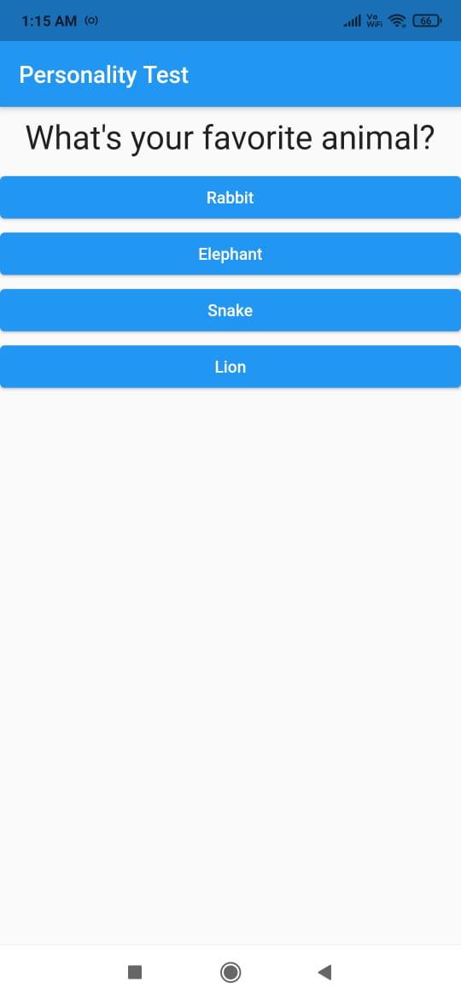

<h1 align="center">Personality Test App</h1>

This is a sample Flutter App which is predicting personality of a person

by asking some pre-researched questions

<h2 align="center">A new Flutter project</h2>

Here are some screenshots of the above App mentioned.

### About Internals...
Advanced Concepts of Dart Programming language is used here like functional programming, classes, objects(Widgets), inheritance, stateful and stateless widgets, etc are used here.

## Getting Started

This project is a starting point for a Flutter application.

A few resources to get you started if this is your first Flutter project:

- [Lab: Write your first Flutter app](https://flutter.dev/docs/get-started/codelab)
- [Cookbook: Useful Flutter samples](https://flutter.dev/docs/cookbook)

For help getting started with Flutter, view our
[online documentation](https://flutter.dev/docs), which offers tutorials,
samples, guidance on mobile development, and a full API reference.
